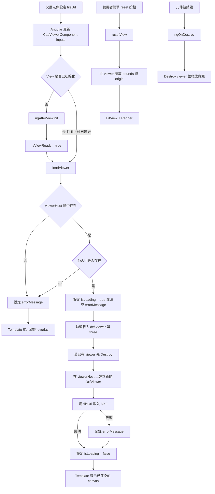

# CAD Viewer 資料流

這個元件會把 Angular input 轉成實際掛載的 `dxf-viewer` 實例，並同步更新 template 的載入與錯誤狀態。

## 補充

- `isViewReady` 用來避免在 `viewerHost` 這個 DOM 節點尚未存在前就呼叫 DXF library。
- `isLoading` 與 `errorMessage` 是 template 直接依賴的兩個狀態。
- 每次 `fileUrl` 改變都會重建 viewer，用來避免殘留舊的內部渲染狀態。
